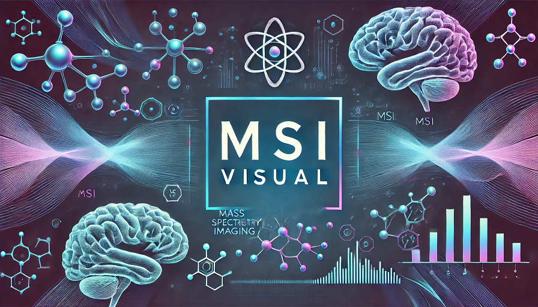
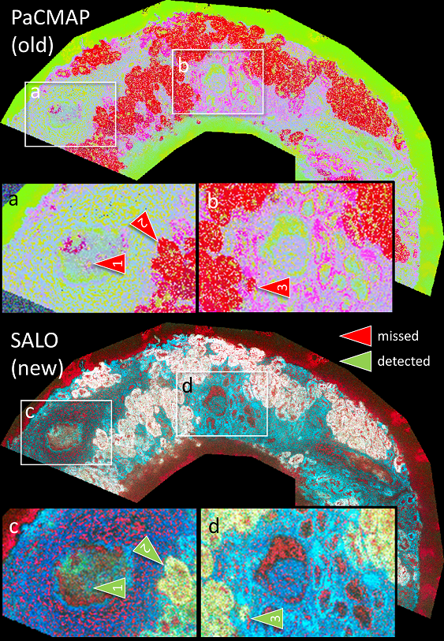
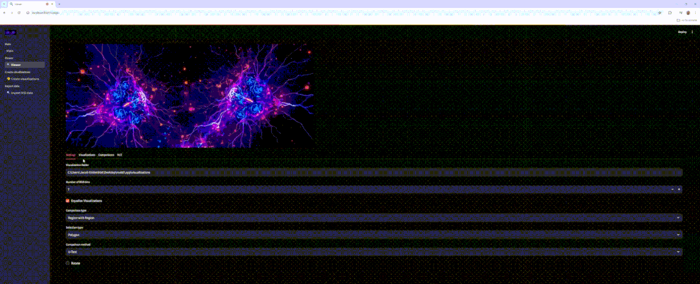

[](https://opensource.org/licenses/MIT)

# MSI-VISUAL: New visualization methods for mass spectrometry imaging and tools for interactive mapping and exploration of m/z values




`pip install msi-visual`

| Feature | Description |
|---------|-------------|
| 🎨 Rich Visualizations | Novel dimensionality reduction methods optimized for MSI data that reveal hidden patterns and structures |
| 🔍 Interactive Exploration | Web interface for exploring MSI data and performing statistical analysis between regions |
| 📊 Statistical Testing | Tools for mapping significant m/z values between different regions |
| 📈 Quantitative Evaluation | Methods for evaluating visualization quality and comparing different approaches |
| 🔄 Data Processing | Scripts for data extraction, normalization and preprocessing from various MSI formats |
| 🛠️ Developer API | Python library with algorithms that can be integrated into other applications |




---

We believe that Mass Spectometry Imaging is the future of biological and medical diagnostics and research. There is extremely rich information in this kind of data that is currently not being utilized. We are on a mission to solve this.

By adapting our research on high global structure preservation dimensionality reduction ([see our preprint at arXiv:2503.07609](https://arxiv.org/abs/2503.07609)) ([python library](https://github.com/jacobgil/pcc)) to MSI, we are able to create extremely detail rich visualizations for MSI, reveleaing details hidden by existing methods like UMAP.

---

MSI-VISUAL is a python package for visualizing and interacting with MSI data.
It is intended for both life science researchers that can use it from an interactive web app, as well as developers that can use the underlying algorithms in their own software.
It includes:
- A python library with multiple novel state of the art visualization, evaluation algorithms for MSI data, methods for statistical testing between different regions, tools for data extraction and normalization, and tools for visualizing region differences.
- A web app (currently based on [streamlit](https://streamlit.io/)) for extracting MSI data, interactively visualizing MSI data, and performing statistical comparison between different regions, to map significant m/z values.

---

# Running the web app

```bash
pip install -e .
```

```bash
streamlit run app/main.py
```





# Using from the python library

## Data format and data extraction

The input files a simply .npy files with tensors of shape rows x cols x number_of_mz_values.


To help you convert your raw MSI data into the required format, we provide several data extraction scripts. Here's a summary of the available data extraction methods:

| Data Format | Import | Script Name | Description |
|-------------|--------|-------------|-------------|
| Bruker TIMS | <pre lang="python">from msi_visual.extract.bruker_tims_to_numpy import BrukerTimsToNumpy</pre> | `scripts/extraction/extract_bruker_tims.py` | Converts Bruker TIMS data (.d folder) |
| Bruker TSF | <pre lang="python">from msi_visual.extract.bruker_tsf_to_numpy import BrukerTSFToNumpy</pre> | `scripts/extraction/extract_bruker_tsf.py` | Converts Bruker TSF data (.d folder) |
| pymzML | <pre lang="python">from msi_visual.extract.pymzml_to_numpy import ImzMLToNumpy` | `scripts/extraction/extract_pymzml.py</pre> | Converts the open source pymzML data format to numpy arrays (.npy files) |

Example running dataset extraction from python code:

```python
extractor = BrukerTimsToNumpy(identifier, start_mz, end_mz, bins, nonzero)
extractor(input_folder, output_folder)
```

if nonzero is set to true, the script will identify m/z values that have non zero intensities somewhere in the data, and will keep only those.
In case peak selection was used, this may reduce the data size substantially.

You can also run the extraction from scripts (and from the User Interface).

```bash
python extract_bruker_tims.py --input_path input_folder --output_path output_folder --bins 5 --num_workers 1 --id some_string_identifier
```


## Data normalization
Two data normalizations are provided: total ion count, and spatial total ion count.
```python
from msi_visual.normalization import total_ion_count, spatial_total_ion_count
data = total_ion_count(data)
data = spatial_total_ion_count(data)
```

Total ION count normalizes every pixel so the sum of the intensities is 1.
Spatial total ion count first normalizes every m/z intensity by a high percentile of that m/z accross the image, spatially, and then performs total ION count.

## Creating visualizations

The input data is expected to be a .npy file with a tensor of shape rows x cols x number_of_mz_values.
See the data extraction section for more information on how to convert your data into this format.

### Dimensionality reduction methods

Supported visualizations are:
| Visualization Name | Import | Description |
|--------------------|--------|-------------|
| Saliency Optimization | <pre lang="python">from msi_visual.saliency_opt import SaliencyOptimization</pre> | A novel optimization-based approach for creating high-fidelity visualizations of MSI data, by preserving high ranking point pair distances |
| NMF (Non-negative Matrix Factorization) | <pre lang="python">from msi_visual.nmf_3d import NMF3D</pre> | Applies NMF to decompose the MSI data into meaningful components. |
| Non-parametric UMAP | <pre lang="python">from msi_visual.nonparametric_umap import MSINonParametricUMAP</pre> | Uses UMAP (Uniform Manifold Approximation and Projection) for dimensionality reduction and visualization of MSI data. |
| Top 3 | <pre lang="python">from msi_visual.percentile_ratio import top3</pre> | Visualizes the top 3 most intense m/z values for each pixel. |
| Percentile Ratio RGB | <pre lang="python">from msi_visual.percentile_ratio import percentile_ratio_rgb</pre> | Creates an RGB image based on the ratio of high to low percentiles of m/z intensities. |

```python
method = SaliencyOptimization(num_epochs=200,
                              regularization_strength=0.001,
                              sampling="random",
                              number_of_points=600,
                              init="coreset")
visualization = method(data)
```

During the first call on an image, the visualization model is trained.
It can also be trained on several images by called `.fit([images])` directly.


### Clustering visualization methods

from msi_visual.kmeans_segmentation import KmeansSegmentation
from msi_visual.nmf_segmentation import NMFSegmentation
| Visualization Name | Import | Description |
|--------------------|--------|-------------|
| K-means Segmentation | <pre lang="python">from msi_visual.kmeans_segmentation import KmeansSegmentation</pre> | Kmeans clustering. |
| NMF Segmentation | <pre lang="python">from msi_visual.nmf_segmentation import NMFSegmentation</pre> | NMF based clustering. |

```python
method = KmeansSegmentation(num_clusters=10)
visualization = method(data)
```
### Combining clustering and dimensionality reduction
In this approach a single dimensional image is created with a method, and is then visualized with a different color scheme in every region segmented by a clustering method.

| Visualization Name | Import | Description |
|--------------------|--------|-------------|
| Rare NMF Segmentation | <pre lang="python">from msi_visual.rare_nmf_segmentation import SegmentationPercentileRatio</pre> | Measure a percentile ratio for every pixel and visualize it. |
| Avg MZ NMF Segmentation | <pre lang="python">from msi_visual.avgmz_nmf_segmentation import SegmentationAvgMZVisualization</pre> | Measure the average m/z in each pixel and visualize it. |
| UMAP NMF Segmentation | <pre lang="python">from msi_visual.umap_nmf_segmentation import SegmentationUMAPVisualization</pre> | Use a 1D UMAP. |

A matplotlib color scheme for each region has to be specified.
One way of generating this is with:
```python
from msi_visual.colorize import AutoColorizeRandom
import json
schemes = json.load(open(r"app\\auto_color_schemes.json"))
color_schemes = AutoColorizeRandom(schemes).colorize(ratio=0.5, k=10)
```

This loads a default color scheme selection, and will select half of the regions to have high frequency color scehems, and the other half to have smoother, gradual color schemes.


```python
method = SegmentationPercentileRatio(joblib.load("nmf_model_k=16.joblib"))
visualization = method.visualize(data, color_schemes)
```


## Evaluating visualizations

Two methods for comparing masks of regions are provided, in order to score m/z values by how significant their presence is in one region compared to the other:
- U-Test: Performs the Mann–Whitney U test between the intensities, for each m/z value, between both regions.
- Difference in ROI-MEAN: Measures the ratio of the mean intensity of the two regions.

```python
from msi_visual.metrics import MSIVisualizationMetrics
metrics = MSIVisualizationMetrics(data, visualization)
```
## Statistical testing between regions
```python
region_comparison = visualizations.RegionComparison(
    data,
    mzs=extraction_mzs)

# stats_method can be "U-Test" or "Difference in ROI-MEAN"
stats_method = "U-Test"
stats = region_comparison.ranking_comparison(mask_a, mask_b, method=stats_method)
```
